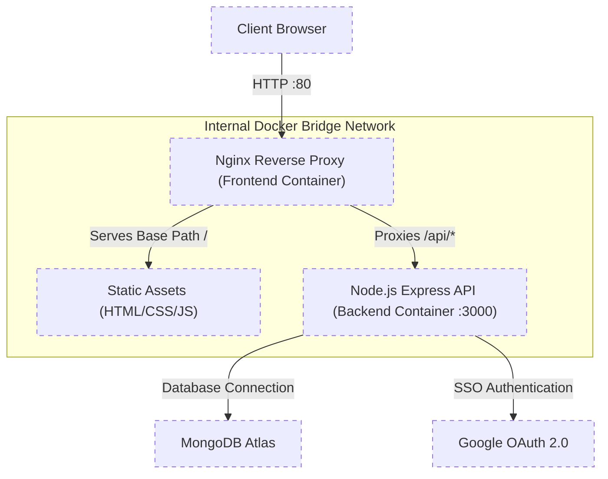

# Full-Stack Weather & Lifestyle Companion

A production-ready, multi-container weather application built with a Node.js/Express backend and a responsive JavaScript frontend. This project demonstrates modern DevOps practices, including containerization, reverse proxying, and secure third-party authentication.

## Key Features

- **Real-time Insights**: Delivers weather-driven lifestyle and safety recommendations via integrated REST APIs.
- **Secure Authentication**: Implemented Google OAuth 2.0 (SSO) for seamless user login.
- **Persistent Storage**: Integrated with MongoDB Atlas for user profile and preference management.
- **Architecture**: Decoupled Frontend and Backend services running in isolated Docker containers.

## Tech Stack

- **Frontend**: HTML5, CSS3, JavaScript (ES6+).
- **Backend**: Node.js, Express.js.
- **Infrastructure**: Docker, Docker Compose, Nginx.
- **Database**: MongoDB Atlas.
- **Auth**: Google OAuth 2.0.

## Architecture & Security

To ensure a secure and professional deployment, this application utilizes an Nginx Reverse Proxy architecture.

### Request Flow and Network Topology



- **Single Entry Point**: Nginx listens on Port 80 and manages all incoming traffic. Static frontend files are served directly, while any request targeting the `/api/*` endpoints is seamlessly proxied to the internal Node.js backend operating on Port 3000.
- **CORS Elimination**: By serving both the frontend client and backend API proxy from the exact same origin (the Nginx container), the application inherently avoids Cross-Origin Resource Sharing (CORS) preflight issues and browser security blocks.
- **Network Isolation**: The Node.js backend is secured within a private Docker bridge network. It is exposed only to the Nginx reverse proxy and remains inaccessible directly from the public internet, substantially reducing the external attack surface.

## How to Run (Production)

You can deploy this application on any Docker-capable host with a single command using the pre-built images hosted on Docker Hub.

### Prerequisites

- Docker & Docker Compose installed.
- A `.env` file containing your MongoDB credentials.

### Setup Instructions

1. **Prepare the Configuration**
   Ensure you have the `docker-compose.yml` file ready. It should be configured to pull the following images:
   - `biasedaf/weather-frontend:v1`
   - `biasedaf/weather-backend:v1`

2. **Environment Variables**
   Create a `.env` file in the same directory as your `docker-compose.yml` file:
   ```env
   MONGO_URI=mongodb+srv://<user>:<password>@cluster.mongodb.net/app
   PORT=3000
   ```

3. **Launch the Application**
   Run the following command to pull the images and start the services in detached mode:
   ```bash
   docker-compose up -d
   ```

4. **Access the Application**
   Open `http://localhost` (or your Server's DNS/IP) in a web browser. Nginx will automatically handle routing your traffic to the appropriate service.
